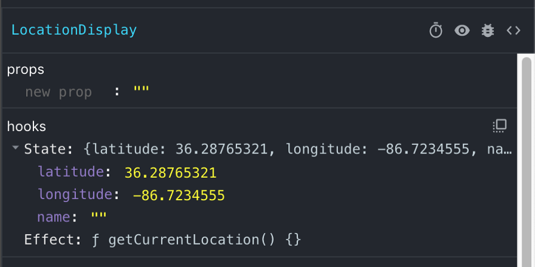
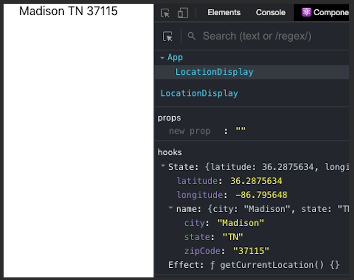

Automatically showing a user's current location is a common feature in websites. Apps that do things like provide weather forecasts or allow a customer to find out what's in stock at their local hardware store will often display the city and zip code that a user is accessing their site from. 

This feature is not super complicated to implement with the help of JavaScript's built-in `Geolocation` object and an API like MapQuest that can convert coordinates to a nice human-sounding address.
I recently included this functionality on a restaurant search app I built, and although I built my app in React, vanilla JavaScript will get the geolocating job done just fine. 

Let's get started!

```javascript
import React from 'react';
import LocationDisplay from './LocationDisplay';

const App = () => (
    <LocationDisplay />
);

export default App;
```
*App.js*
```javascript

import React, { useState, useEffect } from 'react';

const LocationDisplay = () => {
  const [location, setLocation] = useState({ latitude: 0, longitude: 0, display: {} });

  const getCurrentLocation = () => {
    const success = (res) => {
      const { latitude, longitude } = res.coords;
      setLocation({ latitude, longitude });
    };
    navigator.geolocation.getCurrentPosition(success);
  };

  useEffect(getCurrentLocation, []);

  return (
  <div classdisplay="userLocation"></div>
  );
};

export default LocationDisplay;
```
*LocationDisplay.js*

We've created a component called `LocationDisplay` that will show our user's location. In this component, we've declared a new state variable called `location`, which is an object with three keys: `latitude`, `longitude`, and `display`. We've initialized these with default values of `0` , `0` and `{}` accordingly.

Under this, we've made a function called `getCurrentLocation` that is called by `useEffect` after our component is mounted. So far, it's just grabbing a user's location and storing it as latitude and longitude using JavaScript's `Geolocation` API. 

The first line of code to run in this function is actually its last line:

```javascript
navigator.geolocation.getCurrentPosition(success)
```

This attempts to get the user's location (if you run this app in your browser, it will likely ask permission the first time), and then it calls whatever function is its argument - in this case `success` - and passes its location information to the function as an argument.

The location information is recieved in the form of an object called `coords `, so in `success` we simply de-structure `coords` and pass its `latitude` and `longitude` values to our state using `setLocation`.

If you run this app as it is it won't display anything yet, but the coordinates of your current location should now be stored in state.


*If you have React developer tools installed (you do, right?), you will see something like this*


So, next we need to convert these robotic-looking numbers into something we actually want to display. We'll need an outside API for that.

I used [MapQuest](https://developer.mapquest.com/), although there are plenty of geocoding API's available, so feel free to use whatever one you wish. To use MapQuest, you'll have to register and get a free API key.

We'll also be using the [axios dependency](https://www.npmjs.com/package/axios) to make our data call, so you'll need to be sure it's installed in your project.
Next, we'll create a file called mapquestData.js which will contain a function we'll use to find the user's city, state and zip code:

```javascript
import axios from 'axios';

const baseURL = 'https://www.mapquestapi.com/geocoding/v1';
const apiKey = '[YOUR_KEY_HERE]';

const getCity = ({ latitude, longitude }) => new Promise((resolve, reject) => {
  axios.get(`${baseURL}/reverse?key=${apiKey}&location=${latitude},${longitude}&outFormat=json`)
    .then((res) => {
      const [info] = res.data.results[0].locations;
      const name = {
        city: info.adminArea5,
        state: info.adminArea3,
        zipCode: info.postalCode.substring(0, 5),
      };
      resolve(name);
    })
    .catch((err) => reject(err));
});

export default { getCity };
```
*mapquestData.js*

Here we are making a "reverse geocoding" call to MapQuest to get the user's location info using the coordinates we have. MapQuest delivers all sorts of data to us, but we're only concerned with the city, state and zip code, so we've grabbed those items and put them into an object called `name` (I used the `substring` method to chop off the zip code extension, but that's optional) which we then return.

So, now we import `mapquestData.js` into `LocationDisplay.js` and use our new function:

```javascript
import React, { useState, useEffect } from 'react';

import mapquestData from './mapquestData';

const LocationDisplay = (props) => {
  const [location, setLocation] = useState({ latitude: 0, longitude: 0, name: '' });

  const getCurrentLocation = () => {
    const success = (res) => {
      const { latitude, longitude } = res.coords;
      mapquestData.getCity({ latitude, longitude })
        .then((name) => setLocation({ latitude, longitude, name }))
        .catch((err) => console.error(err));
    };
    navigator.geolocation.getCurrentPosition(success);
  };

  useEffect(getCurrentLocation, []);

  const { name } = location;

  return (
    <div className="userLocation">
      {name.city} {name.state} {name.zipCode}
    </div>
  );
};

export default LocationDisplay;
```
*LocationDisplay.js*

And viola! We've added the `getCity` promise to our `getCurrentLocation` function, and upon receiving the data from MapQuest we push everything into state…which triggers React to re-render the DOM with our user's beautifully written location:


*(No, these are not my actual home coordinates)*

Obviously you can style this however you wish, but we now have our user's location displayed in an easy to use component.